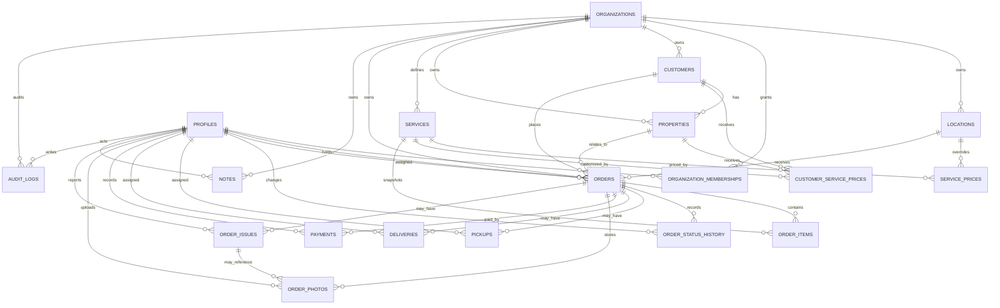

# ER Diagram

Status: Active

Version: 0.1

Last Updated: 2026-07-27

Current Mission: APP-002

---

## Purpose

Show the MVP entity relationship model for APP-002.

---

## Contents

Diagram notes:

- `organizations` is the tenant boundary.
- Some child tables inherit tenant access through `orders`.
- `notes` uses scoped entity references and must still carry `organization_id`.
- The diagram omits detailed fields; full field requirements live in Domain Model, Entities and Database Design.
